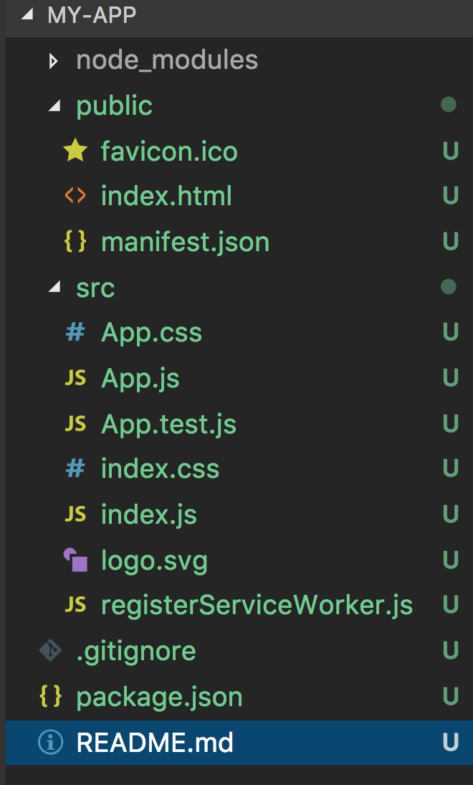

# create-react-app修改配置
 对于create-react-app生成的脚手架，所有的配置用react-scripts包封装了起来。如果我们想要修改里面的配置，我们可以用以下几种方法：
## eject
* 在此之前，我们用create-react-app(CRA)命令生成的文件目录如下图


 并没有独立的config文件，package.json的命令配置有一条eject命令
```js
"eject": "react-scripts eject"
```
此命令是把react-scripts中的配置反编译出来。把config配置文件暴露出来，任意修改。
* 执行命令
```shell
npm run eject
```
生成了配置文件，如下图绿色部色


注：这样改有个不便之处就是以文件的形式配置了。之前是以包的形式配置。最新的配置只需升级包就可以了，然而现在不能。
## 替换react-scripts
* 通过命令
```shell
create-react-app your-scripts
```
首先自己封装好一个webpack配置，用npm puck命令生成包your-scripts，在CRA的时候指定对应的包。这样以后升级了包可以通过命令来升级整个配置
## 使用react-app-rewired
如果觉得上面两种方法比较麻烦，只是要在自己的项目里对react-scripts里的配置做些扩展，那么建议你使用react-app-rewired。
* 安装 
```shell
npm install react-app-rewired --save-dev
```
* 改变package.json配置文件入口，看[官网](https://github.com/timarney/react-app-rewired#3-flip-the-existing-calls-to-react-scripts-in-npm-scripts)
```js
  "scripts": {
        -   "start": "react-scripts start",
        +   "start": "react-app-rewired start",
        -   "build": "react-scripts build",
        +   "build": "react-app-rewired build",
        -   "test": "react-scripts test --env=jsdom",
        +   "test": "react-app-rewired test --env=jsdom"
    }
```
* 创建config-ouerrides.js文件对webpack配置进行扩展
```js
 module.exports=function override(config,env){
     //...
     return config;
 }

```
第一个参数config是传入webpack的配置，最后返回config对象。


